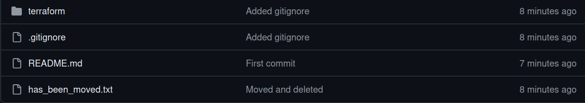
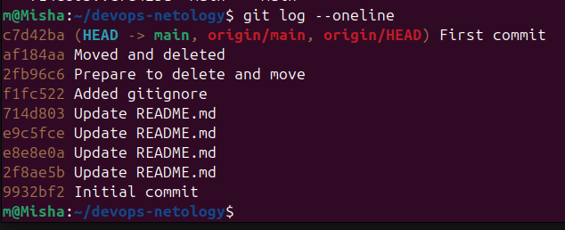

# devops-netology

Репозиторий для курса по системам контроля версий.  
Автор: Misha Chehlov

## История коммитов

| Коммит | Описание |
|--------|----------|
| Initial commit | Создан GitHub при инициализации репозитория |
| First commit | Правки в README.md (добавлена история коммитов) |
| Added gitignore | Добавлены .gitignore и описание в README |
| Prepare to delete and move | Созданы will_be_deleted.txt и will_be_moved.txt |
| Moved and deleted | Удален will_be_deleted.txt, переименован will_be_moved.txt → has_been_moved.txt |

## Какие файлы игнорируются в terraform/.gitignore (расшифровка правил)

В файле `terraform/.gitignore` прописаны следующие правила:

- `**/.terraform/*` — игнорируются все файлы и папки внутри любой директории `.terraform` (рекурсивно).  
  Звёздочка `*` означает «любое количество любых символов», а двойная звёздочка `**` — «в любой вложенной папке».
- `*.tfstate` и `*.tfstate.*` — игнорируются файлы состояний Terraform с любым расширением после `.tfstate`.  
  Здесь `*` заменяет любую последовательность символов до или после указанного фрагмента.
- `crash.log` и `crash.*.log` — игнорируется файл `crash.log`, а также любые файлы, где между `crash` и `.log` может находиться произвольный текст.  
  В этом случае `*` выступает как «любой фрагмент имени файла».
- `override.tf`, `override.tf.json`, `*_override.tf` — игнорируются файлы переопределений с фиксированными именами, а также все файлы, оканчивающиеся на `_override.tf`.  
  Символ `*` в начале означает «любая префиксная часть имени».
- `*.tfvars` — игнорируются любые файлы переменных.  
  `*` здесь покрывает любое имя файла перед расширением `.tfvars`.

## Результаты выполнения задания

### Структура репозитория

### История коммитов

